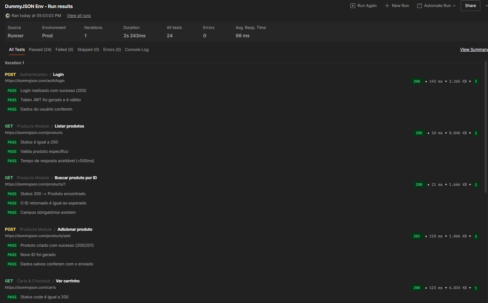
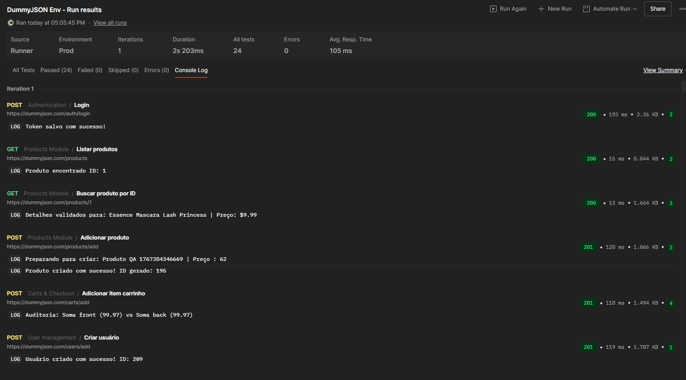
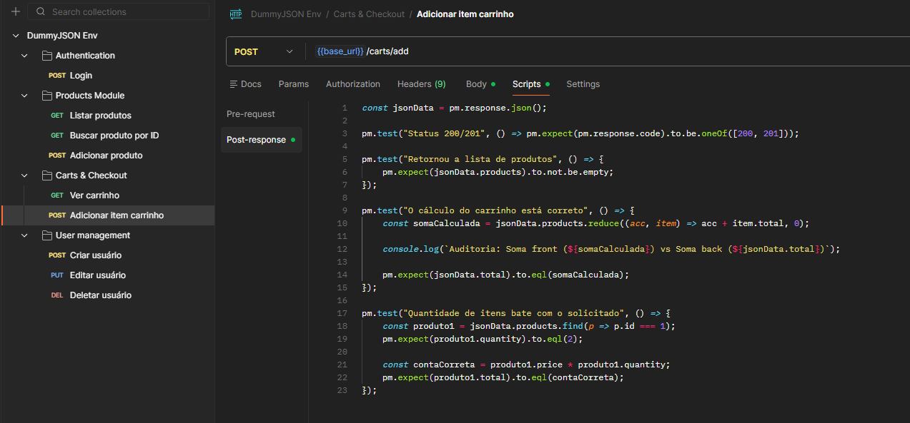

# DummyJSON API Automation

Projeto de automação de testes de API utilizando Postman e JavaScript (ES6+), com foco na validação de fluxos completos de e-commerce e na integridade de regras de negócio, especialmente financeiras.

O objetivo deste projeto é simular cenários reais de QA, indo além da validação de status HTTP, verificando se o backend se comporta corretamente em cálculos, contratos e regras críticas do negócio.

## Tecnologias Utilizadas
* **Postman** (Client & Runner)
* **JavaScript** (ES6+ Features: Arrow Functions, Reduce, Find, Destructuring)
* **DummyJSON** (API de Testes)

## Cenários Cobertos

### 01. Authentication
* Login com validação de JWT Token
* Persistência de sessão utilizando variáveis de ambiente
* Validação de respostas e estrutura do payload

### 02. Products Management
* Busca de produtos utilizando métodos de Array (`.find`).
* Validação de tipos de dados e performance.
* Cadastro de produtos com dados dinâmicos (Pre-request Script).

### 03. Carts & Checkout (Destaque)
* **Auditoria Financeira:** Uso do método `.reduce()` para recalcular a soma total do carrinho e validar se o Backend está somando corretamente.
* Validação de multiplicação (Preço Unitário x Quantidade) item a item.

### 04. User Management (CRUD)
* Criação de usuários com **Faker Data** (Variáveis dinâmicas).
* Testes de Update (PUT) e Deleção Lógica (DELETE).

---

## Evidências de Execução

### 1. Resumo da Execução (Collection Runner)

### 2. Auditoria Financeira (Logs)
Validando matemática do servidor via Console:

### 3. Código Moderno (Snippet)
Exemplo de uso de `.reduce` e `.find`:

---

## Como Rodar este Projeto

1.  Clone o repositório.
2.  Importe a Collection e o Environment (pasta `/collections`) no seu Postman.
3.  Selecione o ambiente `DummyJSON Env`.
4.  Execute via **Collection Runner**.

---
*Desenvolvido por Felipe.*
